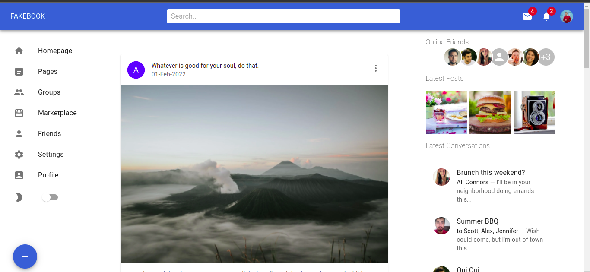

<h1> Facebook clone using React </h1>
Learning components approach to building dynamic sites. 
   
   
  

  
 

## Demo link:

Access my site at [link](https://statuesque-travesseiro-fd97e7.netlify.app/)

## Table of Content:

- [About The App](#about-the-app)
- [Screenshots](#screenshots)
- [Technologies](#technologies)
- [Setup](#setup)
- [Approach](#approach)
- [Status](#status)
- [Credits](#credits)
- [License](#license)

## About The App

Just a demo project to try and use material ui to create site like facebook.

## Screenshots

## Technologies

I used `react` and `material-ui`

## Setup And Usage

- download or clone the repository
- run `npm install`
- run `npm start`

## Status

Project is completed with basic features. You can request for new features. or Fork and create PR for the same. `Version 2` will be out soon after adding new features.

## Credits

List of contriubutors:

- [Ashish Pawar](https://github.com/ashishpawar517)

## License

MIT license @ [Ashish Pawar](https://github.com/ashishpawar517/facebook-clone-react/blob/main/LICENSE)

